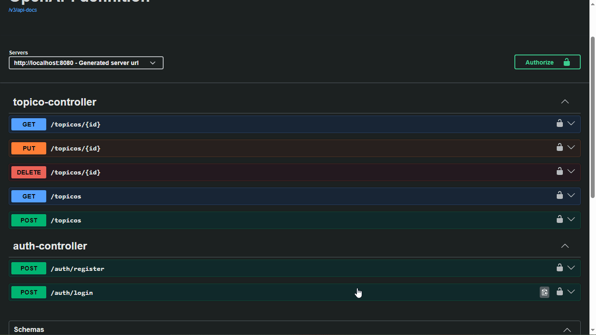

<div align="center">
  
  
# ForoHub API

[](https://opensource.org/licenses/MIT)
[](https://spring.io/projects/spring-boot)
[](https://www.oracle.com/java/)
[](https://www.mysql.com/)
[](https://jwt.io/)

</div>

## 📝 Índice

- [Sobre el Proyecto](#-sobre-el-proyecto)
- [Características](#-características)
- [Requisitos del Sistema](#-requisitos-del-sistema)
- [Instalación y Configuración](#-instalación-y-configuración)
  - [Clonar el Repositorio](#1-clonar-el-repositorio)
  - [Configurar Variables de Entorno](#2-configurar-variables-de-entorno)
  - [Ejecutar la Aplicación](#3-ejecutar-la-aplicación)
- [Documentación de la API](#-documentación-de-la-api)
- [Guía de Uso](#-guía-de-uso)
  - [Registro de Usuario](#1-registro-de-usuario)
  - [Inicio de Sesión](#2-inicio-de-sesión)
  - [Listar Tópicos](#3-listar-tópicos)
  - [Crear Tópico](#4-crear-tópico)
  - [Detalle de Tópico](#5-detalle-de-tópico)
  - [Actualizar Tópico](#6-actualizar-tópico)
  - [Eliminar Tópico](#7-eliminar-tópico)
- [Consideraciones Futuras](- [Licencia](#-licencia)
- [Agradecimientos](#-agradecimientos)

## 🧠 Sobre el Proyecto

**ForoHub API** es una API REST desarrollada en Java con Spring Boot 3, destinada a servir como backend para una plataforma de foros. Permite a los usuarios registrarse, autenticarse y gestionar tópicos (crear, leer, actualizar y eliminar), todo ello protegido mediante autenticación basada en tokens JWT.

## ✨ Características

- **API RESTful:** Cumple con los principios REST para una comunicación clara y eficiente.
- **Autenticación y Autorización JWT:** Seguridad robusta para proteger los recursos mediante tokens firmados.
- **Gestión de Usuarios:** Registro y autenticación de usuarios.
- **Gestión de Tópicos:** CRUD completo para tópicos, incluyendo título, mensaje, curso, estado y autor.
- **Paginación:** Listados de tópicos con soporte para paginación y ordenación.
- **Documentación Automática:** Documentación de la API disponible a través de Swagger UI.
- **Persistencia de Datos:** Utiliza Spring Data JPA con Hibernate para interactuar con la base de datos.

---

## 🧰 Requisitos del Sistema

- **Java 17** o superior
- **Maven 3.6.x** o superior
- **Base de Datos Relacional** (MySQL, PostgreSQL, H2, etc.)
- *(Opcional)* **Git** para clonar el repositorio

---

## 🚀 Instalación y Configuración

### 1. Clonar el Repositorio

```bash

git clone https://github.com/TU_USUARIO/forohub-api.git
cd forohub-api
```

---

### 2. Configurar Variables de Entorno
La aplicación lee la configuración desde el archivo src/main/resources/application.properties. Debes editar este archivo para adaptarlo a tu entorno local.

Base de Datos
Driver: El proyecto está configurado para usar MySQL por defecto (spring.datasource.driver-class-name=com.mysql.cj.jdbc.Driver).

URL: Ajusta la URL de conexión (spring.datasource.url) con el nombre de tu base de datos, host y puerto.
Ejemplo: jdbc:mysql://localhost:3306/forohub_db

Usuario y Contraseña: Cambia spring.datasource.username y spring.datasource.password por tus credenciales locales.

Autenticación JWT
Clave Secreta: Es crucial cambiar el valor de app.jwt.secret por una cadena segura, larga y compleja. Esta clave es fundamental para la seguridad de los tokens.
Ejemplo: app.jwt.secret=UNA_CADENA_DE_CARACTERES_MUY_LARGA_Y_COMPLEJA_Y_SEGURA_CON_CARACTERES_ESPECIALES_NUMEROS_Y_MAYUSCULAS_MINUSCULAS_12345!@#$%^&*()_+-=[]{}|;:,.<>?

Emisor (Issuer): Puedes cambiar app.jwt.issuer si lo deseas.

Duración del Token: Ajusta app.jwt.expiration-in-minutes según tus necesidades (por ejemplo, 30 minutos, 60 minutos, 1440 minutos para 1 día).

Ejemplo de application.properties:

properties
#### Configuración del Servidor
server.port=8080
```
## Configuración de la Base de Datos (MySQL)
spring.datasource.url=jdbc:mysql://localhost:3306/forohub_db?createDatabaseIfNotExist=true
spring.datasource.username=tu_usuario_mysql
spring.datasource.password=tu_contraseña_mysql
spring.datasource.driver-class-name=com.mysql.cj.jdbc.Driver

## Configuración de JPA / Hibernate
spring.jpa.hibernate.ddl-auto=update # Importante: usar 'update' o 'validate' en producción
spring.jpa.show-sql=true
spring.jpa.properties.hibernate.format_sql=true

## Configuración para Flyway (opcional, deshabilitado por defecto)
## spring.flyway.enabled=false

## Propiedades para JWT
app.jwt.secret=UNA_CADENA_DE_CARACTERES_MUY_LARGA_Y_COMPLEJA_Y_SEGURA_CON_CARACTERES_ESPECIALES_NUMEROS_Y_MAYUSCULAS_MINUSCULAS_12345!@#$%^&*()_+-=[]{}|;:,.<>?
app.jwt.issuer=forohub-api
app.jwt.expiration-in-minutes=1440 # Expira en 24 horas (ajusta según necesites)
```
---

### 3. Ejecutar la Aplicación
Desde la raíz del proyecto, ejecuta:

bash
mvn spring-boot:run
La aplicación iniciará en http://localhost:8080.

---

## 📖 Documentación de la API
La API está documentada automáticamente usando Swagger UI. Una vez que la aplicación esté en ejecución, puedes acceder a la interfaz gráfica en:

text
http://localhost:8080/swagger-ui/index.html
Allí encontrarás todos los endpoints disponibles, sus parámetros, cuerpos de solicitud y códigos de respuesta, junto con la posibilidad de probarlos directamente.

---

## 📸 Demostración

### 🧪 Peticiones con Hoppscotch


*Ejemplo de peticiones realizadas desde Hoppscotch (alternativa a Insomnia/Postman)*

### 📚 Documentación interactiva con Swagger UI



*Explora y prueba la API directamente desde Swagger UI*

---

## 🛠️ Guía de Uso
Nota: Todos los endpoints protegidos requieren un token JWT en el encabezado de autorización:
Authorization: Bearer <tu_token>


### 1. Registro de Usuario
Endpoint: POST /auth/register

Descripción: Registra un nuevo usuario en el sistema.

Cuerpo de la Solicitud (JSON):

json
{
  "nombre": "Nombre del Usuario",
  "email": "usuario@ejemplo.com",
  "password": "contraseña_segura"
}
Respuesta Exitosa: 200 OK o 201 Created (según implementación).

Autenticación: No requerida.


### 2. Inicio de Sesión
Endpoint: POST /auth/login

Descripción: Inicia sesión con credenciales válidas y obtiene un token JWT.

Cuerpo de la Solicitud (JSON):

json
{
  "email": "usuario@ejemplo.com",
  "password": "contraseña_segura"
}
Respuesta Exitosa: 200 OK

json
{
  "token": "eyJhbGciOiJIUzI1NiIsInR5cCI6IkpXVCJ9..."
}
Autenticación: No requerida.


### 3. Listar Tópicos
Endpoint: GET /topicos

Descripción: Obtiene una lista paginada de tópicos.

Parámetros de Consulta (Opcionales):

page: Número de página (por defecto 0).

size: Tamaño de la página (por defecto 10).

sort: Criterio de ordenación (por defecto fechaCreacion,asc).

curso: Filtrar por nombre del curso.

Respuesta Exitosa: 200 OK

json
{
  "content": [
    {
      "id": 1,
      "titulo": "Mi Primer Tópico",
      "mensaje": "Hola, ¿cómo estás?",
      "fechaCreacion": "2026-03-08T10:00:00",
      "status": "NO_RESPONDIDO",
      "autorId": 1,
      "curso": "Java"
    }
  ],
  "totalPages": 1,
  "totalElements": 1,
  // ... más campos de paginación
}
Autenticación: Requerida.


### 4. Crear Tópico
Endpoint: POST /topicos

Descripción: Crea un nuevo tópico.

Cuerpo de la Solicitud (JSON):

json
{
  "titulo": "Nuevo Tópico",
  "mensaje": "Contenido del nuevo tópico.",
  "curso": "Spring Boot"
}
Respuesta Exitosa: 201 Created

json
{
  "id": 6,
  "titulo": "Nuevo Tópico",
  "mensaje": "Contenido del nuevo tópico.",
  "fechaCreacion": "2026-03-08T11:00:00",
  "status": "NO_RESPONDIDO",
  "autorId": 1,
  "curso": "Spring Boot"
}
Autenticación: Requerida.


### 5. Detalle de Tópico
Endpoint: GET /topicos/{id}

Descripción: Obtiene los detalles de un tópico específico.

Parámetros de Ruta:

id: ID del tópico.

Respuesta Exitosa: 200 OK

json
{
  "id": 1,
  "titulo": "Mi Primer Tópico",
  "mensaje": "Hola, ¿cómo estás?",
  "fechaCreacion": "2026-03-08T10:00:00",
  "status": "NO_RESPONDIDO",
  "autorId": 1,
  "curso": "Java"
}
Autenticación: Requerida.


### 6. Actualizar Tópico
Endpoint: PUT /topicos/{id}

Descripción: Actualiza la información de un tópico existente (excepto el autor).

Parámetros de Ruta:

id: ID del tópico a actualizar.

Cuerpo de la Solicitud (JSON):

json
{
  "titulo": "Título Actualizado",
  "mensaje": "Mensaje del tópico actualizado.",
  "curso": "Java Avanzado"
}
Respuesta Exitosa: 200 OK

json
{
  "id": 1,
  "titulo": "Título Actualizado",
  "mensaje": "Mensaje del tópico actualizado.",
  "fechaCreacion": "2026-03-08T10:00:00",
  "status": "NO_RESPONDIDO",
  "autorId": 1,
  "curso": "Java Avanzado"
}
Autenticación: Requerida.


### 7. Eliminar Tópico
Endpoint: DELETE /topicos/{id}

Descripción: Elimina un tópico específico.

Parámetros de Ruta:

id: ID del tópico a eliminar.

Respuesta Exitosa: 204 No Content

Autenticación: Requerida.

---

## 🔮 Consideraciones Futuras
Roles de Usuario: Implementar roles (Admin, Moderador, Usuario) para controlar permisos de lectura/escritura/eliminación.

CRUD de Usuarios: Permitir que los usuarios actualicen su perfil o eliminen su cuenta.

CRUD de Respuestas: Permitir que los usuarios respondan a los tópicos.

Filtros Avanzados: Añadir más opciones de filtrado para los listados (por ejemplo, por estado, autor, fechas).

Auditoría: Añadir campos de auditoría (createdBy, updatedBy, createdAt, updatedAt) a las entidades.

Validación Personalizada: Añadir más validaciones específicas del dominio (por ejemplo, longitud mínima de mensajes).

Pruebas Unitarias e Integración: Aumentar la cobertura de pruebas.

---
### 📄 Licencia
Este proyecto está licenciado bajo la Licencia MIT. Consulta el archivo LICENSE para más detalles.

---

## 👨‍💻 Autor

<div align="center">
  
  <br>
  <strong>Tu Nombre Completo</strong>
  <br>
  <a href="https://github.com/JulioCesarValencia">GitHub</a> •
  <a href="https://linkedin.com/in/julio-cesar-valencia">LinkedIn</a>
  <br>
  <sub>Desarrollador Java | Spring Boot | APIs REST</sub>
</div>

---

## 🙏 Agradecimientos

A la comunidad de Alura por el desafío inspirador.

A **Alura Latam** y **ONE (Oracle Next Education)** por el desafío inspirador.

A Auth0 por la biblioteca java-jwt.

A Spring por sus maravillosos frameworks.

A Lombok por reducir el código repetitivo.

A Hibernate por el ORM.

A Swagger / Springdoc por la documentación automática.

A mi amigo y colega Julio César Valencia por su dedicación, paciencia y entusiasmo durante el desarrollo. ¡Tu compromiso fue fundamental para llevar este proyecto a cabo!

<div align="center"> Hecho con ❤️ por Julio Cesar Valencia ¡Gracias por visitar! </div> 

